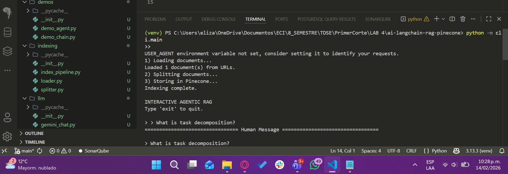
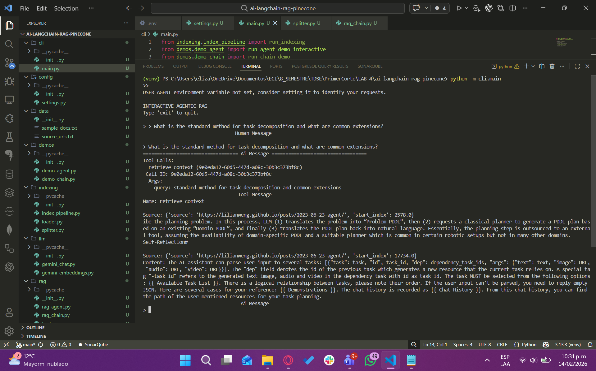

# AI LangChain RAG with Gemini and Pinecone

## Overview

Retrieval-Augmented Generation (RAG) system that combines the power of LangChain, Google Gemini, and Pinecone to create an intelligent assistant that answers questions grounded in indexed content.

### Key Technologies

| Component | Technology | Function |
|-----------|-----------|---------|
| **Orchestration** | LangChain | RAG workflow management |
| **LLM & Embeddings** | Google Gemini | Response generation and vectorization |
| **Vector Database** | Pinecone | Persistent embeddings storage |

### Implemented RAG Strategies

- **Agentic RAG**: Tool-based approach with dynamic reasoning. The model decides when to search for information.
- **Single-Call RAG Chain**: Retrieval and context injection in a single model call.

---

## Architecture

### Two-Phase Workflow

#### 1. Indexing (One-time)

```
Load Documents → Split into Chunks → Generate Embeddings → Store in Pinecone
```

**Process Details:**
- Load documents from configured URLs
- Divide content into manageable chunks
- Generate embeddings with Gemini
- Persist vectors in Pinecone

#### 2. Retrieval and Generation (Runtime)

```
User Query → Search in Pinecone → Inject Context → Gemini Generates Response
```

### Flow Diagram

```
┌─────────────────────┐
│   User Query        │
└──────────┬──────────┘
           │
           ▼
┌─────────────────────┐
│   Retriever         │
│ (Pinecone Search)   │
└──────────┬──────────┘
           │
           ▼
┌─────────────────────┐
│  Gemini Model       │
│ (Context + Question)│
└──────────┬──────────┘
           │
           ▼
┌─────────────────────┐
│   Final Response    │
└─────────────────────┘
```

---

## Project Structure

```
ai-langchain-rag-pinecone/
│
├── cli/
│   └── main.py                      # Entry point (runs demos)
│
├── indexing/
│   ├── loader.py                    # Document loading from URL
│   ├── splitter.py                  # Split documents into chunks
│   └── index_pipeline.py            # Orchestrate indexing process
│
├── llm/
│   ├── gemini_chat.py               # Chat model configuration
│   └── gemini_embeddings.py         # Embeddings configuration
│
├── rag/
│   ├── tools.py                     # Retrieval tool
│   ├── rag_agent.py                 # Agentic RAG implementation
│   └── rag_chain.py                 # RAG chain implementation
│
├── vectorstore/
│   └── pinecone_store.py            # Pinecone integration
│
├── demos/
│   ├── demo_agent.py                # Interactive agent demo
│   └── demo_chain.py                # RAG chain demo
│
├── data/
│   ├── sample_docs.txt              # Sample documents
│   └── source_urls.txt              # Source URLs for indexing
│
├── config/
│   └── settings.py                  # Central configuration
│
├── .env                             # Environment variables
├── requirements.txt                 # Project dependencies
└── README.md                        # This file
```

### Core Components

| Module | Responsibility | Components |
|--------|-----------------|-------------|
| **indexing** | Data preparation and indexing | Loader, Splitter, Pipeline |
| **llm** | LLM and embeddings configuration | Gemini Chat, Embeddings |
| **vectorstore** | Vector persistence | Pinecone Store |
| **rag** | Retrieval and generation logic | Agent, Chain, Tools |
| **demos** | Usage examples | Agent Demo, Chain Demo |
| **cli** | Command-line interface | Main Entry Point |
---

## Installation and Configuration

### Step 1: Create Virtual Environment

```bash
python -m venv venv
```

**Activate the environment:**

**Windows:**
```bash
venv\Scripts\activate
```

**Mac/Linux:**
```bash
source venv/bin/activate
```

### Step 2: Install Dependencies

```bash
pip install -r requirements.txt
```

**Or install manually (optional):**

```bash
pip install langchain
pip install langchain-google-genai
pip install langchain-pinecone
pip install langchain-text-splitters
pip install langchain-community
pip install bs4
pip install python-dotenv
```

### Step 3: Configure Environment Variables

Create a `.env` file in the project root:

```env
GOOGLE_API_KEY=your_google_api_key
PINECONE_API_KEY=your_pinecone_api_key
PINECONE_INDEX=rag-lilianweng
PINECONE_CLOUD=aws
PINECONE_REGION=us-east-1
```

**Variable Explanations:**

| Variable | Purpose |
|----------|---------|
| `GOOGLE_API_KEY` | Access to Google Gemini |
| `PINECONE_API_KEY` | Access to vector database |
| `PINECONE_INDEX` | Index name in Pinecone |
| `PINECONE_CLOUD` | Cloud provider (aws, gcp, azure) |
| `PINECONE_REGION` | Deployment region |

---

## Running the Project

### First Run: Indexing

Indexing is a one-time process that prepares documents for later retrieval.

**Steps:**

1. Edit `cli/main.py` and uncomment:

   ```python
   run_indexing()
   ```

2. Run:

   ```bash
   python -m cli.main
   ```

3. The process will:
   - Load documents from configured URLs
   - Split content into processable chunks
   - Generate embeddings with Gemini
   - Store vectors in Pinecone

**Expected Result:**



---

### Run Agentic RAG

Flexible implementation that allows the model to decide when and how to search for information.

**Steps:**

1. In `cli/main.py`, uncomment:

   ```python
   run_agent_demo()
   ```

2. Run:

   ```bash
   python -m cli.main
   ```

3. You will see interactive mode:

   ```
   INTERACTIVE AGENTIC RAG
   Type 'exit' to quit.
   ```

4. Ask questions about indexed content. The agent will:
   - Decide if it needs to search for information
   - Retrieve relevant chunks
   - Generate grounded responses

**Expected Result:**



---

### Run Single-Call RAG Chain

Greater efficiency with guaranteed retrieval and automatic context injection.

**Steps:**

1. In `cli/main.py`, uncomment:

   ```python
   run_chain_demo()
   ```

2. Run:

   ```bash
   python -m cli.main
   ```

3. The system will execute:
   - Automatic retrieval of relevant context
   - Context injection into the query
   - Generate response grounded in a single LLM call

---

## Implemented RAG Strategies

### Agentic RAG

**Characteristics:**
- Uses retrieval tools controlled by the model
- The LLM autonomously decides when to search for information
- Enables multi-step reasoning and complex logic
- Greater flexibility and adaptability

**Advantages:**
- Dynamic and adaptive reasoning
- Explicit control over when to retrieve information
- Ideal for complex queries

**Disadvantages:**
- Requires multiple LLM calls
- Higher latency
- Higher API costs

---

### Single-Call RAG Chain

**Characteristics:**
- Automatic retrieval of relevant context
- Context injection into the prompt
- Single model call for generation
- Deterministic and predictable flow

**Advantages:**
- Lower latency
- Lower API costs
- Simple and direct flow

**Disadvantages:**
- Retrieval always occurs (possibly unnecessary)
- Less flexible for complex reasoning
- Limited context injection capacity

---

## Usage Example

### Typical Query

**Question:**
```
What is task decomposition?
```

**Expected Processes:**

1. **Retrieval**: The system searches Pinecone for chunks related to "task decomposition"
2. **Context Injection**: Relevant chunks are included in the LLM prompt
3. **Generation**: Gemini generates a response grounded in indexed documents
4. **Result**: Clear response without hallucinations, based on actual content

---

## Design Decisions

| Decision | Justification |
|----------|---------------|
| **Gemini as LLM** | Unified integration of embeddings and chat in single provider |
| **Pinecone as vectorstore** | Scalable and reliable vector database |
| **Modular architecture** | Clear separation of concerns (indexing, retrieval, inference) |
| **Two RAG strategies** | Architectural comparison and option based on use case |


---

## Recommended Usage Flow

1. **Initial Setup** (one-time)
   - Venv + dependencies
   - Environment variables (.env)
   - Run indexing

2. **Development and Testing**
   - Run `demo_agent.py` for interactive testing
   - Run `demo_chain.py` to validate RAG strategy

3. **Integration**
   - Import classes from `rag/` module
   - Use directly in your application
   - Customize prompts and configurations

---

## API Requirements

Ensure you have valid credentials at:

- [Google Cloud Console](https://console.cloud.google.com) - Gemini API Key
- [Pinecone Dashboard](https://www.pinecone.io) - API Key and configured index

---
